# Technical Diagrams and System Architecture

## Overview

This document provides comprehensive visual documentation of the ZM R-Tree Research project, including class diagrams, system architecture, data flow patterns, and performance evaluation frameworks. These diagrams serve as essential reference materials for understanding the system design, implementation relationships, and experimental methodology.

## Table of Contents

1. [System Architecture Diagram](#system-architecture-diagram)
2. [Class Diagrams](#class-diagrams)
3. [Data Flow Diagrams](#data-flow-diagrams)
4. [Spatial Index Structure Diagrams](#spatial-index-structure-diagrams)
5. [Performance Evaluation Framework](#performance-evaluation-framework)
6. [Query Processing Pipeline](#query-processing-pipeline)
7. [Morton Code Generation Process](#morton-code-generation-process)
8. [Neural Network Architecture](#neural-network-architecture)

---

## System Architecture Diagram

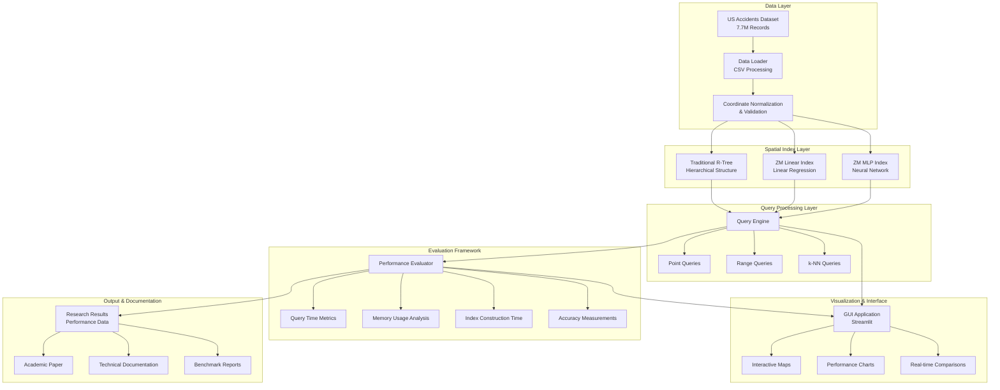

---

## Class Diagrams

### Core Index Classes

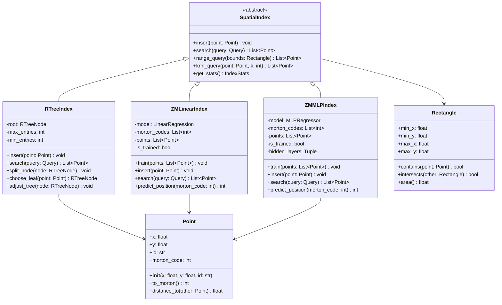

### Data Processing Classes

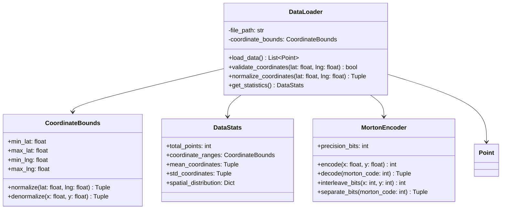

### Query Processing Classes

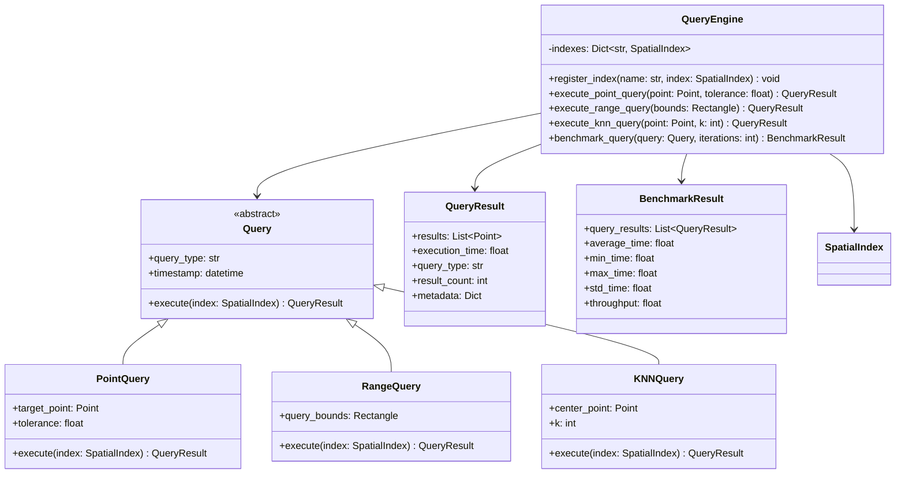

### Evaluation Framework Classes

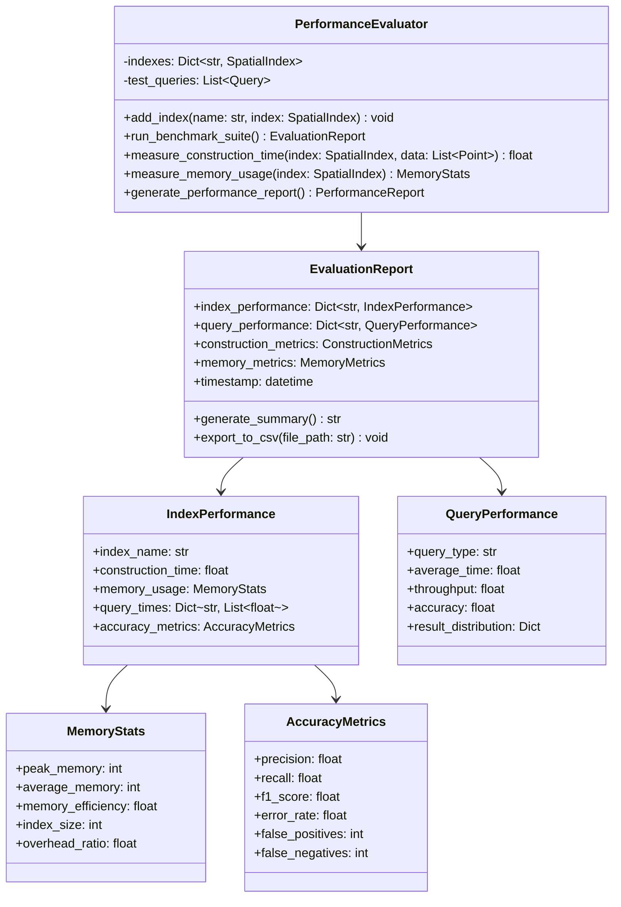

---

## Data Flow Diagrams

### Data Processing Pipeline

```mermaid
flowchart TD
    A[Raw CSV Data<br/>US_Accidents_March23.csv] --> B[Data Validation<br/>Check Coordinates]
    B --> C{Valid Data?}
    C -->|Yes| D[Coordinate Normalization<br/>Scale to [0,1]]
    C -->|No| E[Error Logging<br/>Skip Invalid Records]
    
    D --> F[Morton Code Generation<br/>Z-order Curve Encoding]
    F --> G[Point Object Creation<br/>Spatial Data Structure]
    
    G --> H[Index Construction Phase]
    H --> I[R-Tree Building<br/>Hierarchical Structure]
    H --> J[ZM Linear Training<br/>Linear Regression Model]
    H --> K[ZM MLP Training<br/>Neural Network Model]
    
    I --> L[Query Processing Ready]
    J --> L
    K --> L
    
    L --> M[Performance Evaluation<br/>Benchmark Execution]
    M --> N[Results Analysis<br/>Statistical Comparison]
    N --> O[Report Generation<br/>Documentation & Visualization]
```

### Query Execution Flow

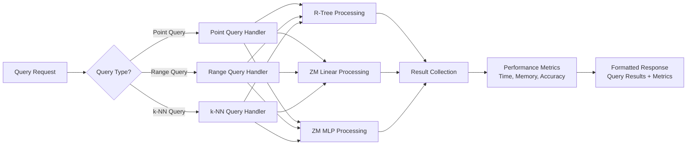

---

## Spatial Index Structure Diagrams

### R-Tree Hierarchical Structure

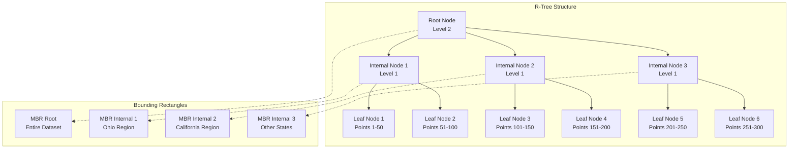

### ZM Index Array Structure

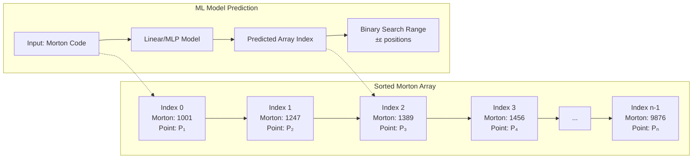

---

## Performance Evaluation Framework

### Benchmark Test Suite

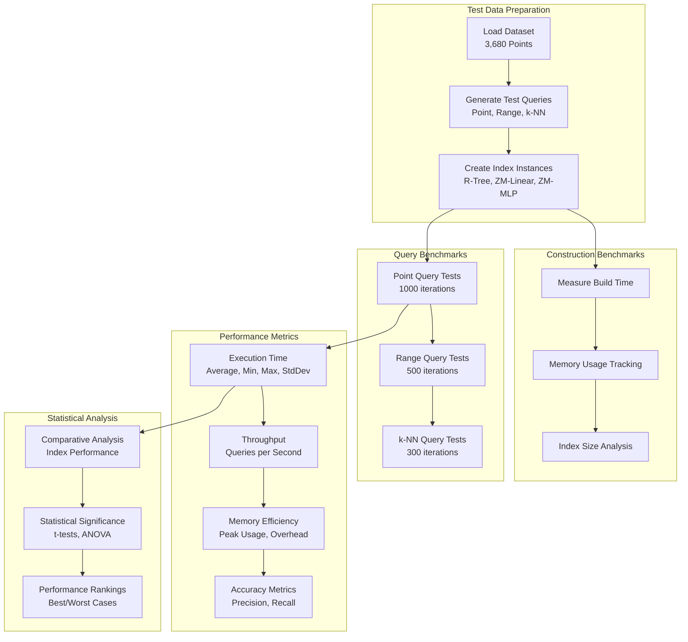

### Results Visualization Pipeline

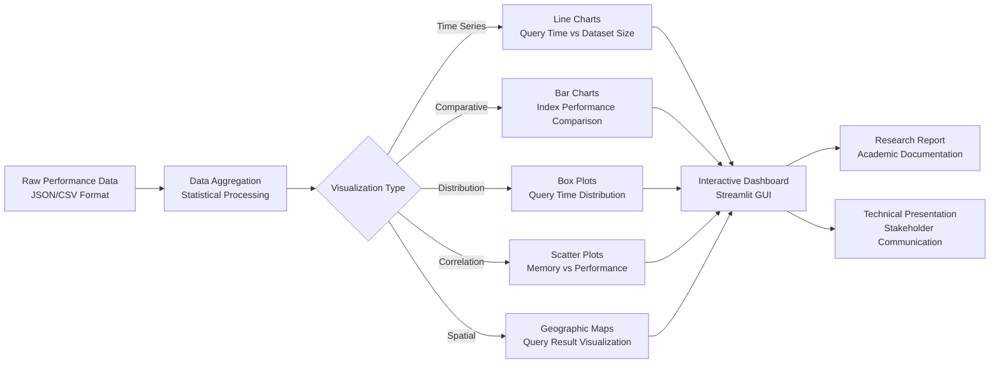

---

## Query Processing Pipeline

### Point Query Processing

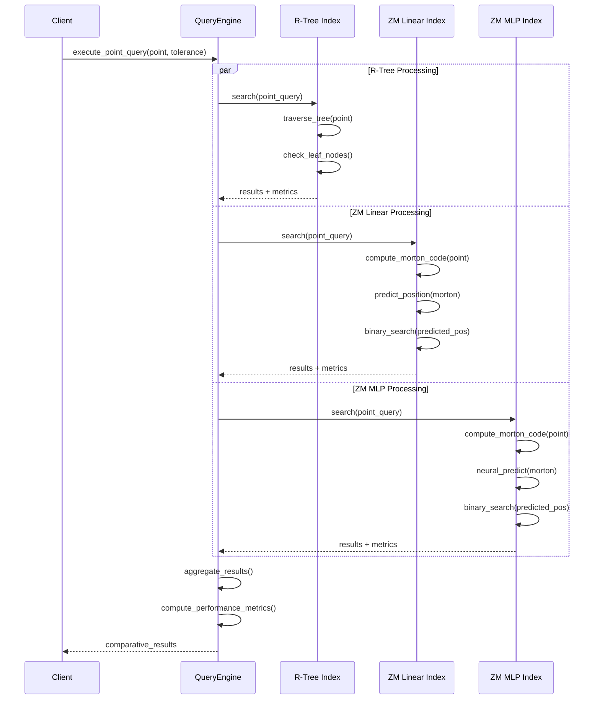

### Range Query Processing

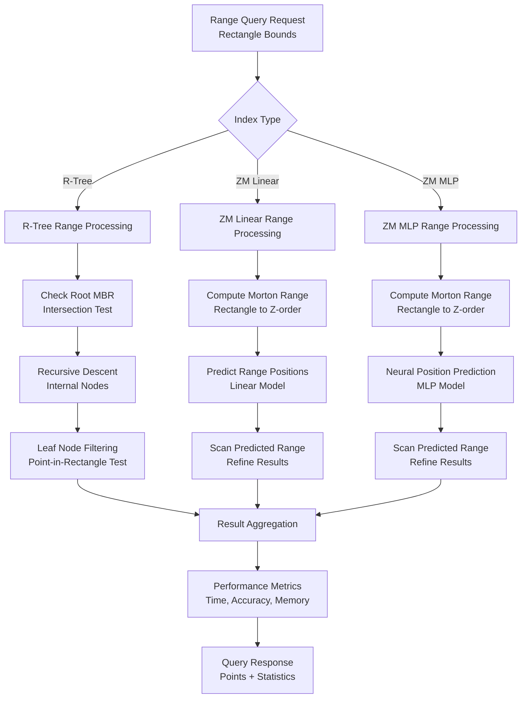

---

## Morton Code Generation Process

### Z-Order Curve Encoding

```mermaid
flowchart TD
    subgraph "Coordinate Input"
        A[Normalized Coordinates<br/>x ∈ [0,1], y ∈ [0,1]] --> B[Scale to Integer Range<br/>x' ∈ [0, 2ⁿ-1]]
    end
    
    subgraph "Bit Interleaving Process"
        B --> C[Binary Representation<br/>x' = b₁b₂...bₙ<br/>y' = c₁c₂...cₙ]
        C --> D[Bit Interleaving<br/>morton = c₁b₁c₂b₂...cₙbₙ]
    end
    
    subgraph "Morton Code Output"
        D --> E[Final Morton Code<br/>Integer Value]
        E --> F[Z-Order Position<br/>Spatial Locality Preserved]
    end
    
    subgraph "Example Calculation"
        G[Point (0.25, 0.75)<br/>x=0.25, y=0.75] --> H[Scale (n=4 bits)<br/>x'=4, y'=12]
        H --> I[Binary<br/>x'=0100₂, y'=1100₂]
        I --> J[Interleave<br/>morton=11010000₂=208₁₀]
    end
```

### Spatial Locality Visualization

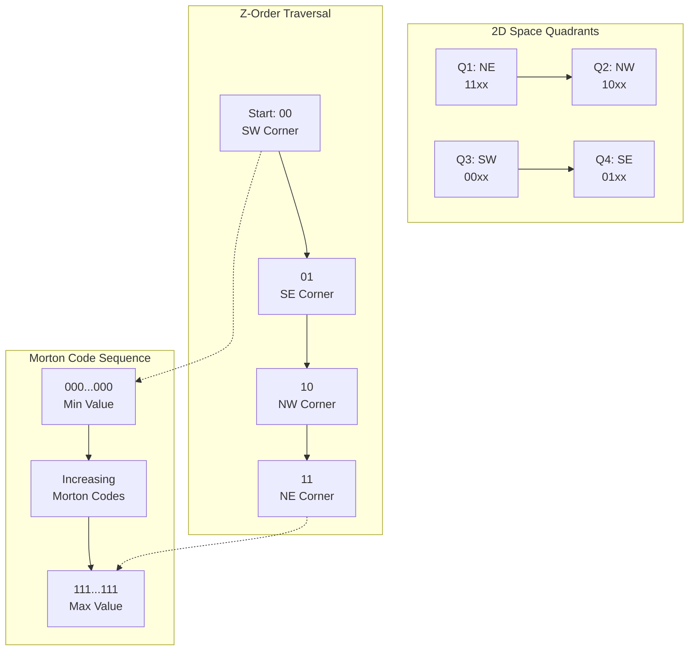

---

## Neural Network Architecture

### ZM MLP Index Structure

```mermaid
graph TB
    subgraph "Input Layer"
        A[Morton Code<br/>Single Integer Input<br/>Range: [0, 2³²-1]]
    end
    
    subgraph "Hidden Layers"
        B[Hidden Layer 1<br/>128 Neurons<br/>ReLU Activation]
        C[Hidden Layer 2<br/>64 Neurons<br/>ReLU Activation]
        D[Hidden Layer 3<br/>32 Neurons<br/>ReLU Activation]
    end
    
    subgraph "Output Layer"
        E[Output Layer<br/>1 Neuron<br/>Linear Activation<br/>Predicted Array Index]
    end
    
    subgraph "Training Process"
        F[Training Data<br/>Morton Code → Array Index<br/>Pairs]
        G[Loss Function<br/>Mean Squared Error]
        H[Optimizer<br/>Adam Algorithm]
        I[Regularization<br/>L2 Penalty]
    end
    
    A --> B
    B --> C
    C --> D
    D --> E
    
    F --> G
    G --> H
    H --> I
    
    subgraph "Model Parameters"
        J[Learning Rate: 0.001<br/>Batch Size: 32<br/>Epochs: 100<br/>Validation Split: 0.2]
    end
```

### Training Data Flow

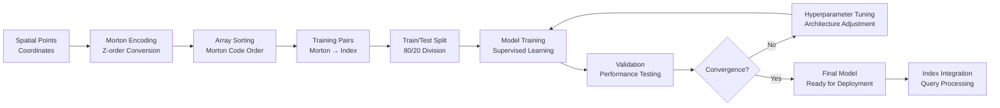

---

## System Integration Diagram

### Complete System Overview

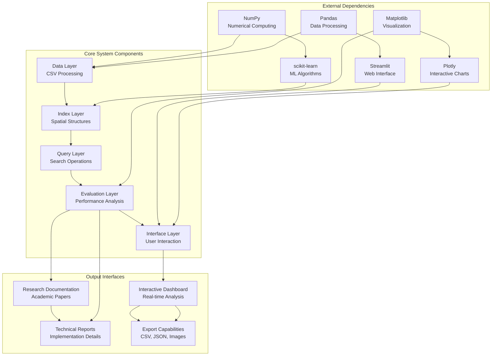

---

## Conclusion

These technical diagrams provide a comprehensive visual reference for the ZM R-Tree Research project, covering all major system components, data flows, and architectural relationships. The diagrams serve multiple purposes:

1. **Design Documentation**: Clear visualization of system architecture and component relationships
2. **Implementation Guide**: Detailed class structures and method interfaces for development
3. **Educational Resource**: Visual learning aids for understanding spatial indexing concepts
4. **Research Communication**: Professional diagrams for academic presentations and publications
5. **Maintenance Reference**: System overview for future development and optimization

The modular design illustrated in these diagrams enables independent development and testing of each component while maintaining clear interfaces and data flow patterns. This architectural approach supports both current research objectives and future extensibility for additional spatial indexing algorithms and evaluation metrics.

---

*This technical diagram documentation complements the comprehensive ZM R-Tree Research project documentation, providing essential visual references for system understanding, implementation, and research communication.*